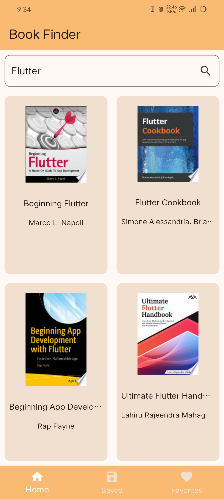
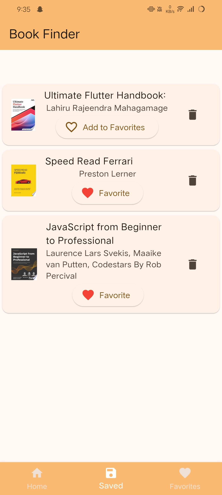
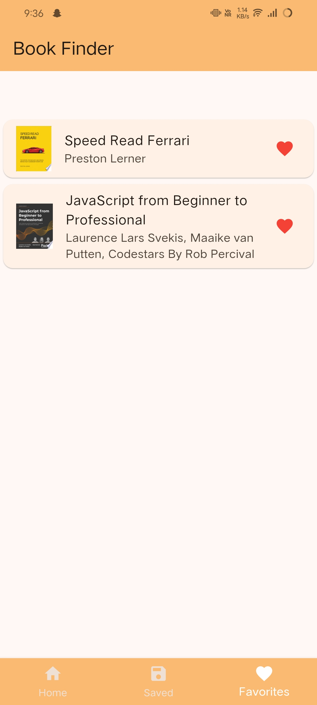

# 📚 Flutter Book Search App


A simple and elegant Flutter app that allows users to search for books, view details, and save their favorite books. This app uses the Google Books API to fetch book data, and the `sqflite` library for local storage, allowing users to save books for future reference.

## ✨ Features

- **Search for Books**: Use the app to search for books by title, author, or keyword.
- **View Book Details**: Get an overview of each book, including title, author, description, and cover image.
- **Save Books**: Save books to your "Saved" page for quick access.
- **Favorites**: Mark your favorite books and access them anytime from the "Favorites" page.

## 📱 Screenshots

| Home Page                                 | Saved Page                                  | Favorites Page                                      |
| ----------------------------------------- | ------------------------------------------- | --------------------------------------------------- |
|  |  |  |

## 🚀 Getting Started

### Prerequisites

- [Flutter SDK](https://flutter.dev/docs/get-started/install) installed
- An IDE like [VS Code](https://code.visualstudio.com/) or [Android Studio](https://developer.android.com/studio)
- Internet connection to fetch book data from the Google Books API

### Installation

1. Clone this repository to your local machine:

   ```bash
   git clone https://github.com/shayan-tej/book_finder.git
   ```

2. Navigate into the project directory:

   ```bash
   cd book_finder
   ```

3. Install the dependencies:

   ```bash
   flutter pub get
   ```

4. Run the app:

   ```bash
   flutter run
   ```

## 🛠️ Libraries Used

- [`http`](https://pub.dev/packages/http) - A composable, Future-based library for making HTTP requests.
- [`path`](https://pub.dev/packages/path) - A library for manipulating file paths.
- [`sqflite`](https://pub.dev/packages/sqflite) - A plugin for Flutter to work with SQLite databases.

## 📂 Project Structure

```plaintext
lib/
├── components/
│   └── gridview_widget.dart         # A custom widget that displays books in a grid view format, used across different pages.
├── db/
│   └── database_helper.dart         # A helper class to manage the SQLite database operations, including saving, retrieving, and deleting books.
├── models/
│   └── book.dart                    # Data model for a Book object, defining its properties (title, author, description, etc.).
├── network/
│   └── network.dart                 # Handles API requests to fetch book data from the Google Books API.
├── pages/
│   ├── book_details.dart            # Screen displaying detailed information about a selected book, such as title, author, and description.
│   ├── favorites_screen.dart        # Page displaying books marked as favorites, allowing users to view their favorite books.
│   ├── home_screen.dart             # Home page where users can search for books using the search bar and view results.
│   └── saved_screen.dart            # Page displaying saved books, allowing users to manage their saved book collection.
├── utils/
│   └── book_details_arguments.dart  # Utility file containing arguments or data structures needed to pass data to the book details page.
└── main.dart                        # App entry point; initializes the app and sets up navigation and routes.

```

## 🌐 API Integration

This app uses the Google Books API to fetch book data using `searchBooks` function in `lib/network/network.dart`.

## 📖 How to Use

1. **Search for Books:** Enter the title, author, or keyword in the search bar on the Home Page. The app will display a list of matching books.
2. **View Book Details:** Tap on any book to see more details, including a summary and cover image.
3. **Save a Book:** Click on the "Save" button to add the book to your Saved list.
4. **Favorite a Book:** Click on the "Favorite" button to add the book to your Favorites list.
5. **View Saved Books:** Navigate to the Saved Page to see books you’ve saved.
6. **View Favorite Books:** Go to the Favorites Page to see your favorite books.

## 🚧 Future Enhancements

- **Add a Rating Feature:** Allow users to rate books.
- **Add Sorting Options:** Sort books by title, author, or popularity.
- **Improve UI/UX:** Make the design more user-friendly and visually appealing.
- **Offline Support:** Cache book data for offline access.

## 🤝 Contributing

Contributions are welcome! Please open an issue or submit a pull request if you’d like to help improve the app.

1. Fork the repository
2. Create your feature branch (`git checkout -b feature/AmazingFeature`)
3. Commit your changes (`git commit -m 'Add some AmazingFeature'`)
4. Push to the branch (`git push branch feature/AmazingFeature`)
5. Open a Pull Request

## 📝 License

This project is licensed under the MIT License - see the LICENSE file for details.

## 🌟 Acknowledgments

- **Flutter Documentation** - A great resource for Flutter development.
- **Google Books API** - For providing the book data.
